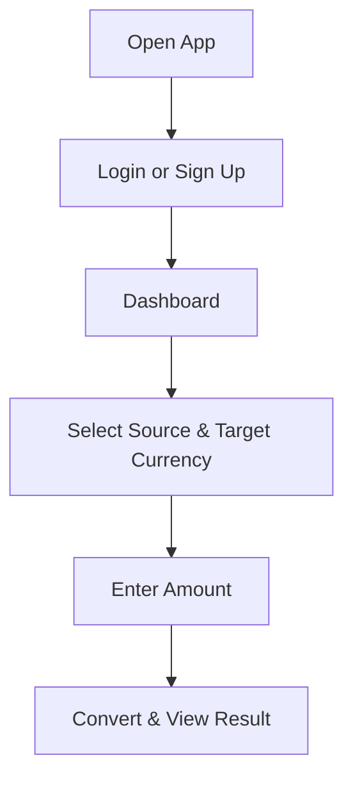

# 💱 Currency Converter App

A full-stack Flutter application to convert currencies using real-time exchange rates, featuring user login and sign-up functionalities. The backend is built using Node.js and Express.js, with secure data handling and a real-time currency API.

---

## 🧠 Theory & Architecture

### 🔁 Features

- **User Authentication**: Register/Login using email & password
- **Currency Conversion**: Fetch and display real-time exchange rates
- **Secure Backend**: Built with Node.js and Express.js
- **Modern Frontend**: Built in Flutter with clean UI


## 🧩 Tech Stack

### Frontend
- Flutter
- Dart
- Provider or Bloc (optional for state management)

### Backend
- Node.js
- Express.js
- MongoDB (Mongoose)
- JWT (Authentication)
- Bcrypt (Password hashing)
- External Currency API (e.g., exchangeratesapi.io)

---

## 🚀 How to Run the App

### 📦 Backend Setup

1. Clone the repository:
   ```bash
   git clone https://github.com/yourusername/currency-converter-app.git
   cd backend
   ```

2. Install dependencies:
   ```bash
   npm install
   ```

3. Create a `.env` file:
   ```env
   PORT=5000
   MONGO_URI=your_mongodb_connection_string
   JWT_SECRET=your_secret_key
   CURRENCY_API=https://api.exchangeratesapi.io/latest
   ```

4. Start the backend server:
   ```bash
   npm run dev
   ```

### 📱 Frontend Setup (Flutter)

1. Navigate to the Flutter project directory:
   ```bash
   cd flutter_app
   ```

2. Get the Flutter packages:
   ```bash
   flutter pub get
   ```

3. Update the API base URL in `lib/services/api_service.dart`:
   ```dart
   const String baseUrl = 'http://localhost:5000';
   ```

4. Run the app:
   ```bash
   flutter run
   ```

---

## 🔐 API Overview

### Authentication

- `POST /api/auth/signup` – Register a new user
- `POST /api/auth/login` – Authenticate user and return JWT

### Currency Conversion

- `GET /api/convert?from=USD&to=INR` – Convert currency using real-time rates

---

## 🛠️ Backend Folder Structure

```
backend/
│
├── controllers/
│   ├── authController.js
│   └── currencyController.js
├── models/
│   └── User.js
├── routes/
│   ├── auth.js
│   └── convert.js
├── middleware/
│   └── authMiddleware.js
├── config/
│   └── db.js
├── .env
├── server.js
└── package.json
```

---

## 📲 Flutter Flow Overview

1. **Login/Signup Page**
2. **Home Page**
   - Currency Dropdown Menus
   - Input Field for Amount
   - Display Converted Result

---

## 📈 User Flow Diagram



---

## ✍️ Contributing

Feel free to fork this project and submit pull requests. Contributions are welcome!

---

## 📄 License

This project is open-source and available under the [MIT License](LICENSE).
